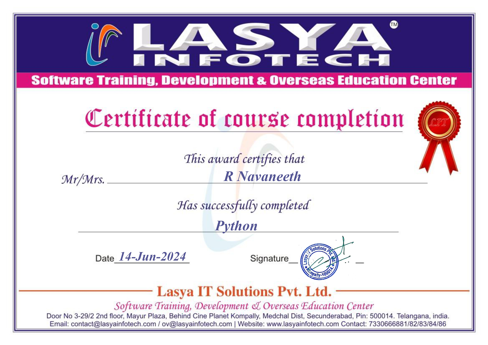

# 📜 Certifications

## 🛡️ CompTIA Security+

**Issued by:** CompTIA  

**Focus Areas:**  
- Network Security  
- Risk Management  
- Threats & Vulnerabilities  
- Security Operations  

 

## Generative AI Foundations Certificate

**Issued by:** upGrad (in collaboration with Microsoft)

**Focus Areas:**

-Introduction to Generative AI

-Prompt Engineering (Basic & Advanced)

-AI-Powered Research & Content Creation

-Generative AI for Analysis, Problem-Solving & Automation

## 🐍 Python Programming Certification

**Issued by:** Lasya Infotech

**Focus Areas:**

-Python Fundamentals

-Control Structures & Functions

-Object-Oriented Programming (OOP)

-Practical Problem Solving with Python

