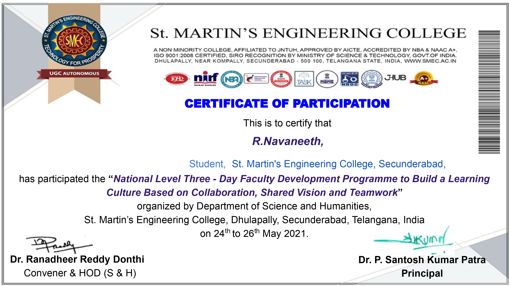
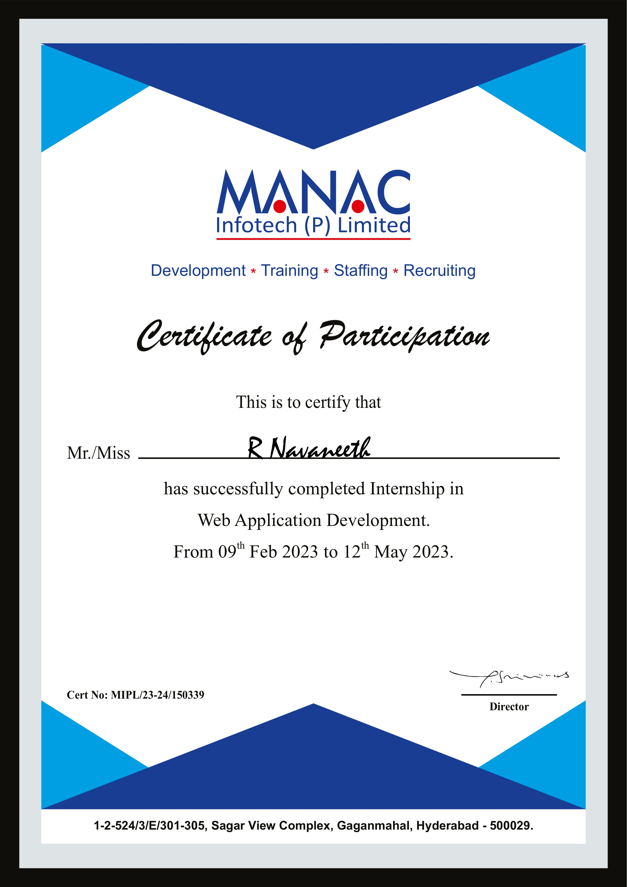

# 📜 Certifications

## 🛡️ CompTIA Security+

**Issued by:** CompTIA  

**Focus Areas:**  
- Network Security  
- Risk Management  
- Threats & Vulnerabilities  
- Security Operations  

 

## 🤖 Generative AI Foundations Certificate

**Issued by:** upGrad (in collaboration with Microsoft)

**Focus Areas:**

-Introduction to Generative AI

-Prompt Engineering (Basic & Advanced)

-AI-Powered Research & Content Creation

-Generative AI for Analysis, Problem-Solving & Automation

## 🐍 Python Programming Certification

**Issued by:** Lasya Infotech

**Focus Areas:**

-Python Fundamentals

-Control Structures & Functions

-Object-Oriented Programming (OOP)

-Practical Problem Solving with Python

🎓 National Level Faculty Development Programme

Issued by: St. Martin's Engineering College (Department of Science and Humanities)

Focus Areas:

Building a Learning Culture

Collaboration & Teamwork

Shared Vision Strategies

Institutional Development

Date: May 24th – 26th, 2021

💻 Internship in Web Application Development

Issued by: MANAC Infotech (P) Limited

Focus Areas:

Web Application Development

Practical Software Implementation

Professional Development & Training

Technical Internship Experience

Date: Feb 09th – May 12th, 2023

